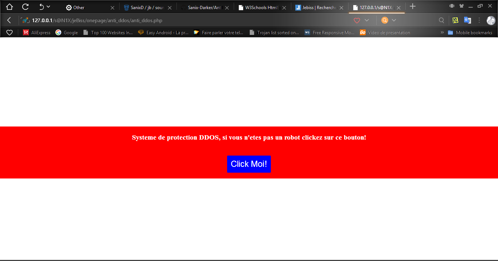

# AntiDDOS-system
A simple way to protect your web site from DDOS attack(FREELY)

<h4> How to use it!</h4>
In your webpage(for example produits.php or index.php), you just have to include the file index.php from anti_ddos: 
<b><i><u>Note: This system only activates when it detects abnormal activity and protect immediatly your website/server</u></i></b>

<.?php  

  &nbsp; &nbsp; session_start();// NEver forget this line 

  &nbsp; &nbsp; include ("anti_ddos/index.php"); //Include file here! 
?> 
<.!DOCTYPE html> 
<.html> 
  &nbsp; &nbsp; <.head> 
      
  &nbsp; &nbsp; 
  &nbsp; &nbsp; <.meta http-equiv="Content-Type" content="text/html; charset=UTF-8"/> 
      
  &nbsp; &nbsp; 
  &nbsp; &nbsp; ... 
  
  &nbsp; &nbsp; <./head> 
  
  &nbsp; &nbsp; <.body> 
    
  &nbsp; &nbsp; 
  &nbsp; &nbsp; <.!-- My Web Page --> 
  
  &nbsp; &nbsp; <./body> 
<./html> 

NB:Remove the "." in the begining of tags, all br tags and nbsp code before use it!!! 

