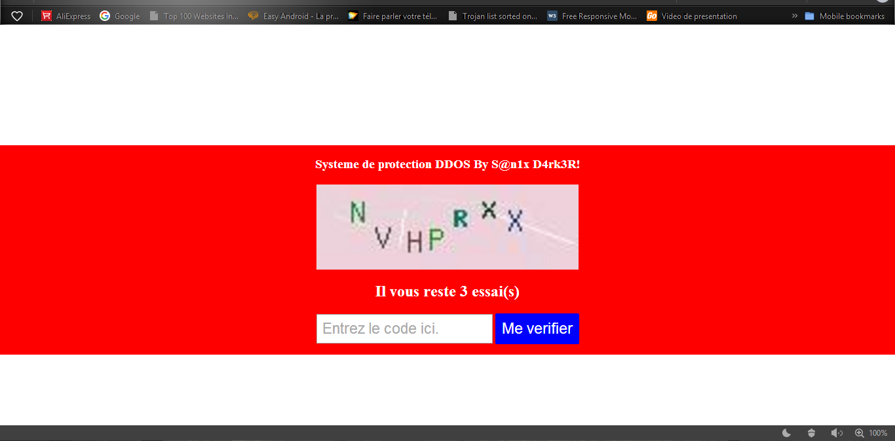

<h1>AntiDDOS-system</h1>
A simple way to protect your web application from DDOS attack(FREELY) in **1** line

## How it work?

At each connection, the system temporarily saves the ip address of the client and monitors its connection frequency, if this connection frequency is abnormal, then the system considers it as a black ip address and sends a verification request in the form of a verification. Captcha integrated into the system, if he passes this check, then it is a human and not a robot!

### Testing...


**"The code has been tested by severals ddos software with a score of 77%."**
## How to use it?
```php
	<?php
		include ("anti_ddos/start.php"); //write this at the top of your PHP application and all is done!!!
	?>
	<!DOCTYPE html>
	<html>
	<head>
		<title>
			Example Web page protected!
		</title>
	</head>
		<body>
			...
			<h2>Example Web page protected!</h2>
			...
		</body>
	</html>
```


## Author

- [Sanix-darker](https://github.com/sanix-darker)

## LICENSE

[MIT License](https://github.com/Sanix-Darker/AntiDDOS-system/blob/master/LICENSE)

PS: Send me feedback to make this project more powerfull than ever! ;-)


